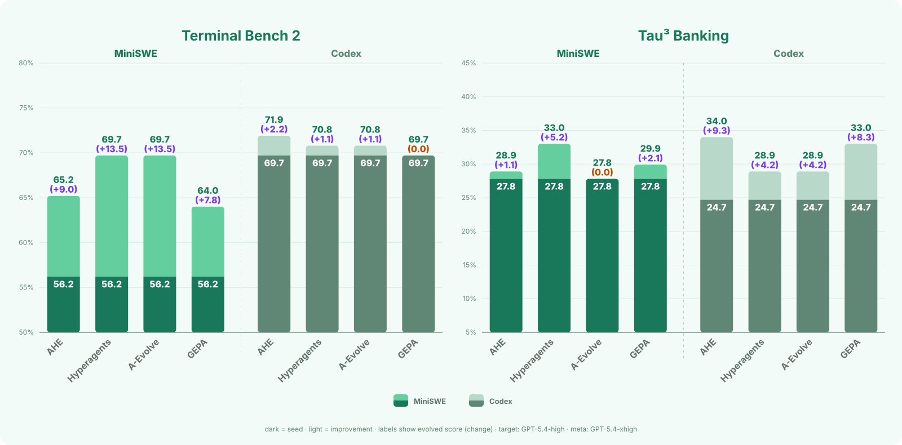

<p align="center">
  
</p>

<p align="center">
  A file-based evolution framework for evaluator-driven learning, reproducible candidate
  lineage, and controllable modification.
</p>

<p align="center">
  <a href="https://github.com/KaiWU5/Awesome-AI4AI">
    
  </a>
  <a href="https://github.com/KaiWU5/Awesome-AI4AI/blob/main/assets/AI4AI-Survey.pdf">
    
  </a>
  <a href="https://simpleagentlab.com/ai4ai/">
    
  </a>
  <a href="LICENSE">
    
  </a>
  <a href="https://github.com/simple-agent-lab/RSIHub/actions/workflows/test.yml">
    
  </a>
  <a href="https://www.python.org/">
    
  </a>
  <a href="https://simpleagentlab.com/RSIHub/">
    
  </a>
</p>

<p align="center">
  <a href="https://simpleagentlab.com/rsihub/">RSIHub Website</a> ·
  <a href="#what-rsihub-does">What RSIHub Does</a> ·
  <a href="#how-rsihub-works">How It Works</a> ·
  <a href="#what-can-evolve">What Can Evolve</a> ·
  <a href="#recipes">Recipes</a> ·
  <a href="#skill-evolution-showcase">Showcase</a> ·
  <a href="#quick-start">Quick Start</a> ·
  <a href="#documentation">Documentation</a>
</p>

> [!TIP]
> **New to AI-for-AI and agent self-improvement?** Start with the curated
> [Awesome-AI4AI](https://github.com/KaiWU5/Awesome-AI4AI) paper list, read the
> [AI4AI Survey (PDF)](https://github.com/KaiWU5/Awesome-AI4AI/blob/main/assets/AI4AI-Survey.pdf)
> for the full landscape, and follow the
> [AI4AI blog](https://simpleagentlab.com/ai4ai/) for ongoing notes from
> Simple Agent Lab. RSIHub is the experimental infrastructure that puts these
> methods on common ground.

<br>

<p align="center">
  <a href="docs/assets/benchmark-results-rsihub-v2.svg">
    
  </a>
</p>

## What RSIHub Does

RSIHub gives an agent a controlled way to improve itself. It runs candidate
agents against a fixed evaluator, keeps the **provenance** of every generation —
what changed and why — and carries verified improvements to the agent forward
while the evaluator itself stays untouched.

- **For agent builders:** Improve prompts, skills, harnesses, and agent code in
  a reusable experiment workspace.
- **For researchers:** Compare evolution strategies under fixed evaluation and
  mutation boundaries.
- **Evidence built in:** Connect every candidate agent to scores, artifacts,
  archive records, and Git lineage.

## How RSIHub Works

Every recipe composes the same loop:

<p align="center">
  <strong>select → rollout → analyze → mutate → guardrail → evaluate → absorb</strong>
</p>

<p align="center">
  <a href="docs/assets/architecture.svg">
    
  </a>
</p>

A recipe decides how parent nodes are selected, how traces are analyzed, what
may be edited, and which evaluations admit a new generation. The framework owns
the two stages that make those decisions inspectable, and executes every trial
on [Harbor](https://github.com/harbor-framework/harbor), which provides
container execution, trajectory capture, and per-task verification.

| Stage | Owned by | What happens |
| --- | --- | --- |
| `select` | recipe | Choose an eligible parent node from the archive and fork its exact commit. |
| `rollout` | recipe | Run the parent node on the training split and return execution evidence. |
| `analyze` | recipe | Distill rollout traces into bounded mutation evidence. |
| `mutate` | recipe | Propose edits inside the declared mutable surface. |
| `guardrail` | **framework** | Check the actual diff against that surface and reject out-of-bounds proposals. |
| `evaluate` | **framework** | Score a clean checkout of the reviewed candidate agent and certify the outcome. |
| `absorb` | recipe | Decide admission, record annotations, and carry lineage forward. |

Three terms cover the composition model:

| Term | Meaning |
| --- | --- |
| `stage` | A fixed lifecycle slot — one row of the table above. |
| `operator` | One reusable implementation of a stage, at `library/<stage>/<name>.py`. |
| `recipe` | Code-free selection and configuration of those operators. |

Evaluation is never a selectable operator — it stays framework-owned. See
[the operator guide](docs/reference/operators.md) for authoring, validating, and
composing operators from the CLI.

## What Can Evolve

| Surface | Examples | Best fit |
| --- | --- | --- |
| prompts and skills | system prompts, task skills, reusable instructions | policy and behavior improvement |
| harnesses and target code | tools, orchestration, agent implementation | agent engineering |
| selected evolution operators | analysis or mutation policy chosen by a recipe | controlled co-evolution |

Each recipe declares its mutable paths. The evaluator, the archive stamps, and
the framework code itself stay outside that surface.

## Browse an Experiment

`evolve view` serves as a read-only view of one generated workspace, or as a
unified index of related workspaces with `--catalog`:

```bash
evolve view /path/to/experiment
```

It shows experiment health, generation progress, modifications, canonical
performance, and paginated trial outcomes. When a workspace retains Harbor
jobs, trial rows open Harbor's full trajectory, logs, verifier output, and
artifacts on the same server. The viewer is a local inspection tool, not an
authorization boundary.

See the [experiment viewer guide](docs/guides/experiment-viewer.md) for
catalogs, remote (DevBox) tunnels, Harbor inspection, and troubleshooting.

## Recipes

| Choose this when you want to… | Recipe | Mutable surface |
| --- | --- | --- |
| improve one candidate agent from its current best parent node | `hill_climb` | target |
| evolve prompts and reusable agent skills | `aevolve` | prompt and target skills |
| engineer the agent harness against evaluator feedback | `ahe` | target |
| balance multiple objectives with minibatch validation | `gepa` | prompt and task skill |
| co-evolve the target and selected evolution policy | `hyperagents` | target and selected operators |

See [the recipe guide](recipes/README.md) for each strategy’s workflow and configuration.

## Skill Evolution Showcase

RSIHub can improve a Skill as a complete package: instructions, references,
and validation scripts evolve together while a frozen evaluator keeps the
comparison honest. In this local Paper2Poster run, the same Codex model and
paper prompt produced both LoRA posters below.

<table>
  <tr>
    <th width="50%">Gen 0 · minimal 12-line Skill</th>
    <th width="50%">Gen 2 · evolved editorial Skill</th>
  </tr>
  <tr>
    <td></td>
    <td></td>
  </tr>
  <tr>
    <td>Deterministic geometry gate failed: 14 text elements overflowed the SVG viewBox.</td>
    <td>Passed deterministic renderability and geometry gates; paper fidelity remained advisory reviewer feedback.</td>
  </tr>
</table>

Across the four-paper showcase, the deterministic completion pass rate moved
from **1/4** at Gen 0 to **4/4** at Gen 2. The trials ran concurrently through Harbor's local
environment without Docker, retaining the full agent trajectories alongside
evaluator-owned visual feedback. This is a representative evolution run rather than a broad
benchmark; see the [result snapshot](docs/results/paper-poster-skill-evolution.json),
[frozen rubric](evals/skills/make-paper-poster/rubric.json), and
[minimal seed Skill](evals/skills/make-paper-poster/seed/skills/make-paper-poster/SKILL.md).

## Quick Start

Run one of the supported recipes against the shared, content-pinned
Terminal-Bench 2.0 subset with `./scripts/setup_terminal_bench.sh` and
`./scripts/run_recipe_demo.sh`. The
[quick start guide](docs/QUICKSTART.md) covers prerequisites, credential setup,
supported recipe values, and launcher overrides.

## Benchmark Results

Scores are percentages shown as **seed → evolved agent**. The train score is measured on
the recipe's training split; the full benchmark score is measured across the
complete benchmark. Parenthesized changes are purple for improvement, orange for
no change, and red for regression. All runs use GPT-5.4 at high reasoning effort
as the target model and a Codex mutate operator backed by GPT-5.4 at xhigh
reasoning effort.

<table width="100%">
  <thead>
    <tr>
      <th align="center" width="18%">Benchmark<br></th>
      <th align="center" width="11%">Target agent<br></th>
      <th align="center" width="13%">Method<br></th>
      <th align="center" width="29%">Train Score<br></th>
      <th align="center" width="29%">Full Benchmark Score<br></th>
    </tr>
  </thead>
  <tbody>
    <tr>
      <td align="center" rowspan="8"><strong>Terminal-Bench 2</strong><br><sub>50 train / 19 gate / 20 sealed</sub></td>
      <td align="center" rowspan="4">MiniSWE</td>
      <td align="center"><a href="https://arxiv.org/pdf/2604.25850">AHE</a></td>
      <td align="center">70.0%&nbsp;→&nbsp;74.0%&nbsp;</td>
      <td align="center">56.2%&nbsp;→&nbsp;65.2%&nbsp;</td>
    </tr>
    <tr>
      <td align="center"><a href="https://arxiv.org/abs/2603.19461">Hyperagents</a></td>
      <td align="center">58.0%&nbsp;→&nbsp;68.0%&nbsp;</td>
      <td align="center">56.2%&nbsp;→&nbsp;69.7%&nbsp;</td>
    </tr>
    <tr>
      <td align="center"><a href="https://github.com/A-EVO-Lab/a-evolve">A-Evolve</a></td>
      <td align="center">66.0%&nbsp;→&nbsp;68.0%&nbsp;</td>
      <td align="center">56.2%&nbsp;→&nbsp;69.7%&nbsp;</td>
    </tr>
    <tr>
      <td align="center"><a href="https://arxiv.org/abs/2507.19457">GEPA</a></td>
      <td align="center">58.0%&nbsp;→&nbsp;68.0%&nbsp;</td>
      <td align="center">56.2%&nbsp;→&nbsp;64.0%&nbsp;</td>
    </tr>
    <tr>
      <td align="center" rowspan="4">Codex</td>
      <td align="center"><a href="https://arxiv.org/pdf/2604.25850">AHE</a></td>
      <td align="center">60.0%&nbsp;→&nbsp;74.0%&nbsp;</td>
      <td align="center">69.7%&nbsp;→&nbsp;71.9%&nbsp;</td>
    </tr>
    <tr>
      <td align="center"><a href="https://arxiv.org/abs/2603.19461">Hyperagents</a></td>
      <td align="center">58.0%&nbsp;→&nbsp;72.0%&nbsp;</td>
      <td align="center">69.7%&nbsp;→&nbsp;70.8%&nbsp;</td>
    </tr>
    <tr>
      <td align="center"><a href="https://github.com/A-EVO-Lab/a-evolve">A-Evolve</a></td>
      <td align="center">62.0%&nbsp;→&nbsp;62.0%&nbsp;</td>
      <td align="center">69.7%&nbsp;→&nbsp;70.8%&nbsp;</td>
    </tr>
    <tr>
      <td align="center"><a href="https://arxiv.org/abs/2507.19457">GEPA</a></td>
      <td align="center">68.0%&nbsp;→&nbsp;68.0%&nbsp;</td>
      <td align="center">69.7%&nbsp;→&nbsp;69.7%&nbsp;</td>
    </tr>
    <tr>
      <td align="center" rowspan="8"><strong>Tau³ Banking</strong><br><sub>50 train / 20 gate / 27 sealed</sub></td>
      <td align="center" rowspan="4">MiniSWE</td>
      <td align="center"><a href="https://arxiv.org/pdf/2604.25850">AHE</a></td>
      <td align="center">20.0%&nbsp;→&nbsp;34.0%&nbsp;</td>
      <td align="center">27.8%&nbsp;→&nbsp;28.9%&nbsp;</td>
    </tr>
    <tr>
      <td align="center"><a href="https://arxiv.org/abs/2603.19461">Hyperagents</a></td>
      <td align="center">28.0%&nbsp;→&nbsp;40.0%&nbsp;</td>
      <td align="center">27.8%&nbsp;→&nbsp;33.0%&nbsp;</td>
    </tr>
    <tr>
      <td align="center"><a href="https://github.com/A-EVO-Lab/a-evolve">A-Evolve</a></td>
      <td align="center">26.0%&nbsp;→&nbsp;26.0%&nbsp;</td>
      <td align="center">27.8%&nbsp;→&nbsp;27.8%&nbsp;</td>
    </tr>
    <tr>
      <td align="center"><a href="https://arxiv.org/abs/2507.19457">GEPA</a></td>
      <td align="center">22.0%&nbsp;→&nbsp;28.0%&nbsp;</td>
      <td align="center">27.8%&nbsp;→&nbsp;29.9%&nbsp;</td>
    </tr>
    <tr>
      <td align="center" rowspan="4">Codex</td>
      <td align="center"><a href="https://arxiv.org/pdf/2604.25850">AHE</a></td>
      <td align="center">32.0%&nbsp;→&nbsp;36.0%&nbsp;</td>
      <td align="center">24.7%&nbsp;→&nbsp;34.0%&nbsp;</td>
    </tr>
    <tr>
      <td align="center"><a href="https://arxiv.org/abs/2603.19461">Hyperagents</a></td>
      <td align="center">34.0%&nbsp;→&nbsp;36.0%&nbsp;</td>
      <td align="center">24.7%&nbsp;→&nbsp;28.9%&nbsp;</td>
    </tr>
    <tr>
      <td align="center"><a href="https://github.com/A-EVO-Lab/a-evolve">A-Evolve</a></td>
      <td align="center">36.0%&nbsp;→&nbsp;38.0%&nbsp;</td>
      <td align="center">24.7%&nbsp;→&nbsp;28.9%&nbsp;</td>
    </tr>
    <tr>
      <td align="center"><a href="https://arxiv.org/abs/2507.19457">GEPA</a></td>
      <td align="center">28.0%&nbsp;→&nbsp;30.0%&nbsp;</td>
      <td align="center">24.7%&nbsp;→&nbsp;33.0%&nbsp;</td>
    </tr>
  </tbody>
</table>

## Trustworthy by Construction

RSIHub separates evolvable policy from the mechanism that judges it:

1. **The evaluator is frozen.** Candidate agents cannot change the scoring contract.
2. **Mutation is bounded.** Each recipe declares which target and operator paths may change.
3. **Evaluation is canonical.** New generations are scored from a clean snapshot of the candidate agent.
4. **Evidence is durable.** Reports recompute results from stamped `archive.jsonl` records and Git generation tags.

Operators run as subprocesses rather than being imported into the framework
process. See [the design guide](docs/concepts/design.md) for the complete ownership model and invariants.

## Project Status

RSIHub is an active prototype for research and controlled experimentation. The
current focus is reliable experiment mechanics, local-first workflows, and
composable strategies for different agent-evolution scenarios.

## Roadmap

- **DeepSeek harness (`dsh`) integration:** a supported target agent alongside
  MiniSWE and Codex.
- **Richer trajectory analysis tooling:** more analyze-stage operators that turn
  retained traces into actionable mutation feedback.
- **Asynchronous evolution:** let selection, rollout, and mutation overlap
  across generations instead of running in lockstep.
- **Scenario-oriented recipes:** opinionated recipes for more agent-evolution
  use cases.
- **Local-first workflows:** first-class Docker-free iteration for trusted
  local agents, prompts, and skills.
- **More method integrations:** additional evolution and search methods under
  the shared evaluator, lineage, and evidence contracts.

## For AI Agents

Working on or with RSIHub from a coding agent? Start here:

- [`llms.txt`](https://simpleagentlab.com/RSIHub/llms.txt) — a
  machine-friendly index of the documentation following the
  [llms.txt convention](https://llmstxt.org/), with links to raw Markdown
  sources.
- [`AGENTS.md`](AGENTS.md) — repository instructions for coding agents,
  including the layered test policy (do not run the full suite after every
  edit).
- [Terminology](docs/reference/terminology.md) — the glossary that defines the
  ubiquitous language used across the framework, recipes, and workspaces.
- [Design](docs/concepts/design.md) and [the architecture map](docs/ARCHITECTURE.md) —
  required reading before non-trivial changes; the operator contract in
  `src/evolve/frozen/interfaces.py` is authoritative for interfaces.

## Documentation

| Document | Purpose |
| --- | --- |
| [Documentation site](https://simpleagentlab.com/RSIHub/) | Installation, operation, concepts, guides, and reference. |
| [Quick start](docs/QUICKSTART.md) | Recipe launcher setup and configuration. |
| [Design](docs/concepts/design.md) | System model, ownership boundaries, and invariants. |
| [Architecture](docs/ARCHITECTURE.md) | Enforced source-module map and line budgets. |
| [Recipes](recipes/README.md) | Supported evolution strategies. |
| [Operators](docs/reference/operators.md) | Authoring, validating, and composing operators. |
| [Experiment viewer](docs/guides/experiment-viewer.md) | Read-only experiment inspection, DevBox tunnels, and Harbor drill-down. |
| [Contributing](.github/CONTRIBUTING.md) | Development setup and repository conventions. |
| [Releasing](docs/RELEASING.md) | Source, artifact, and publication checklist. |

## License

RSIHub is licensed under [Apache-2.0](LICENSE). See
[NOTICE](NOTICE) for required attributions.
