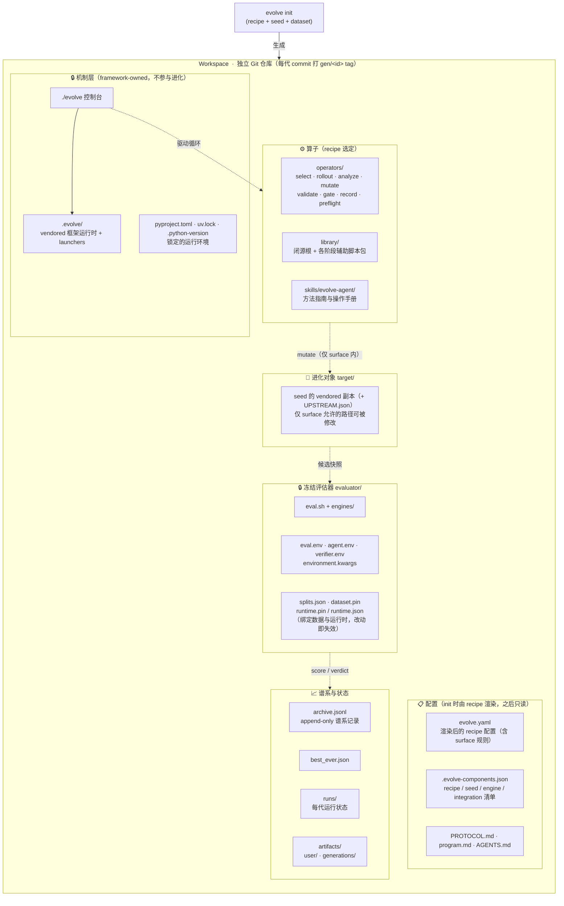
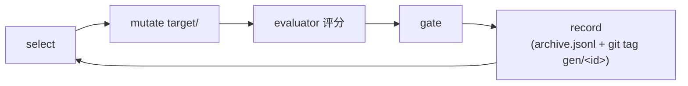

# Evolve Workspace 结构草图

`evolve init` 以「recipe + seed + dataset」为输入，生成一个自包含的 workspace。
它本身是一个独立的 Git 仓库：每个候选代（generation）是一次 commit，并打上
`gen/<id>` 标签；`archive.jsonl` 记录 append-only 的谱系。



## 一轮循环（简化）



## 目录速览

```text
workspace/
├── evolve                    # 控制台（唯一入口）
├── .evolve/                  # 🔒 vendored 框架运行时
├── evolve.yaml               # 渲染后的 recipe 配置
├── .evolve-components.json   # 组件清单
├── operators/                # recipe 选定的算子脚本
├── library/                  # 算子辅助脚本包
├── skills/evolve-agent/      # 操作手册
├── evaluator/                # 🔒 冻结评估器（eval.sh、splits.json、*.pin …）
├── target/                   # 🧬 进化对象（seed 副本，surface 内可改）
├── archive.jsonl             # append-only 谱系
├── best_ever.json
├── runs/                     # 每代运行状态
└── artifacts/                # user/ 与 generations/ 持久上下文
```

要点：只有 `target/` 中 surface 允许的路径参与进化；`.evolve/` 与
`evaluator/` 受保护，谱系字段由机制盖章，不作为候选输入。
